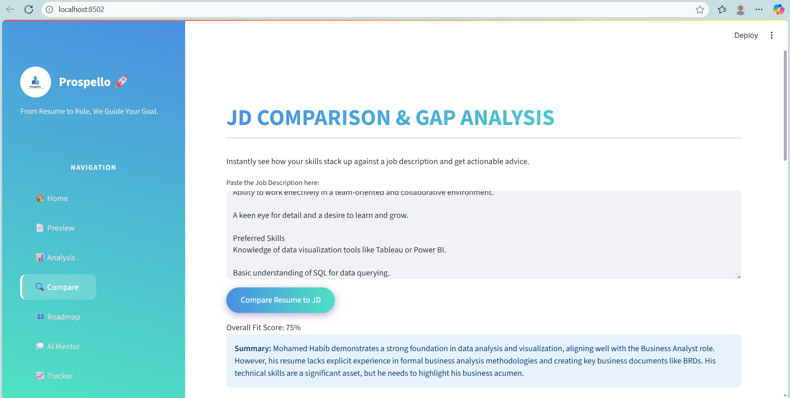

# 🚀 Prospello

  

**Prospello** is an AI-powered career companion that guides job seekers from resume creation to role readiness. It provides intelligent resume analysis, skill gap detection, personalized career roadmaps, AI mentorship, and job application tracking—all in one platform.

---

## 🌟 Key Features

### 1. 🏠 Home
- Upload your PDF resume.
- AI extracts all relevant information (profile, experience, skills, projects).
- Start a new session anytime.

### 2. 📄 Resume Preview
- View your professional profile in a structured, AI-powered dashboard.
- Sections include:
  - Profile: Name, email, phone, LinkedIn, GitHub
  - Summary: Auto-generated overview
  - Skills: Programming, Tools & Platforms, Libraries, Soft Skills
  - Experience: Role, Company, Dates, Responsibilities
  - Projects: Name, Description, Link

### 3. 📊 Advanced Analysis
- Compare resume with a Job Description (JD).
- Provides **ATS Match Score**, **Experience Relevance**, **Keyword Optimization**, **Formatting & ATS Readiness**, and **Improvement Suggestions**.
- Generates a **detailed 10-point analysis report**.

### 4. 🔍 JD Comparison & Gap Analysis
- Detect missing, matched, and unique skills versus JD.
- Provides actionable next steps to improve resume alignment.
- Helps in targeting roles effectively.

### 5. 🗺️ Personalized Career Roadmap
- Generate 30-day actionable roadmap for:
  - Target Job Role
  - Specific Job Description
- Focuses on bridging skill gaps to land the desired role.

### 6. 💭 AI Mentor
- Chat with a GPT-powered AI mentor.
- Get personalized guidance on:
  - Career choices
  - Skill development
  - Interview preparation
- Resume context is considered for more accurate advice.

### 7. 📈 Job Application Tracker
- Interactive Kanban board to manage job applications.
- Track stages: Wishlist → Applied → Interviewing → Offer → Rejected.
- Add, update, and delete job applications.

### 8. 📧 Feedback
- Submit feedback and suggestions for improving Prospello.

---

## 📸 Screenshots

**Home / Upload Resume**  
  

**Resume Preview Dashboard**  
  

**Analysis Dashboard**  
  

**Gap Analysis**  
 

**Career Roadmap**  
 

**AI Mentor & Tracker**  
 

**Tracker**  
 

**About**  
 

**Feedback**  
  

---

## 🚀 Quick Start

#Clone the repository

git clone https://github.com/halcyon-habib/Prospello.git
cd Prospello

#Create virtual environment

python -m venv venv
#Activate environment

#Windows

venv\Scripts\activate
#macOS/Linux

source venv/bin/activate

#Install dependencies

pip install -r requirements.txt

#Run the Streamlit app

streamlit run app.py

# 🚀 Prospello – Technical Overview

---

## 🛠️ Technologies Used

Prospello leverages modern AI and web technologies to provide a seamless career guidance experience:

- **Frontend:**  
  - **Streamlit:** Interactive web interface for dashboards and chat features  
  - **HTML & CSS:** Custom styling for a clean, professional look

- **Backend:**  
  - **Python:** Core programming language for AI logic and app functionality  
  - **Pandas:** Data manipulation and processing for resume and JD analysis  
  - **datetime:** Timestamp management for job tracking and roadmap scheduling

- **AI & NLP:**  
  - **GPT-powered Resume Parsing:** Extracts structured information from resumes  
  - **Career Roadmap Generation:** Creates personalized 30-day action plans  
  - **AI Mentor Chatbot:** Provides context-aware career advice  
  - **Keyword & Gap Analysis:** Compares resume with Job Descriptions

- **PDF Processing:**  
  - **pdfminer.six / PyPDF2:** Extract text from PDF resumes

---

## 📂 Folder Structure

Prospello/
│

├── app.py # Main Streamlit application

├── styles.css # Custom CSS for UI design

├── logo.png # Application logo

├── utils/ # AI & analysis modules

│ ├── pdf_processor.py # Extract text from PDFs

│ ├── resume_analyzer.py # Compare resume with JD and provide scores

│ ├── gap_analyzer.py # Perform skill gap analysis

│ ├── roadmap_generator.py # Generate personalized career roadmaps

│ ├── mentor.py # AI mentor chat functionality

│ └── parser.py # Resume parsing and structuring

├── assets/ # Screenshots and other images

└── requirements.txt # Python dependencies

---

## 🤖 AI & Functional Details

### Resume Parsing
- Extracts **profile, summary, skills, experience, and projects**.
- Structures resume into a dashboard for easy viewing.

### Resume Analysis
- Measures:
  - **ATS Match Score**  
  - **Experience Relevance**  
  - **Keyword Optimization**  
  - **Formatting & ATS Readiness**
- Generates **actionable improvement suggestions**.

### Gap Analysis
- Compares your skills with job descriptions.
- Highlights **missing, matched, and unique skills**.
- Calculates a **fit score** for each JD.

### Career Roadmap
- Generates a **30-day personalized plan** based on resume and target role.
- Suggests skills, projects, and certifications to bridge gaps.

### AI Mentor
- GPT-powered chatbot for **career advice, interview prep, and skill development**.
- Uses **resume context** for tailored responses.

### Job Application Tracker
- Interactive **Kanban board** to manage applications.
- Supports adding, updating, deleting, and moving applications across stages:
  - Wishlist → Applied → Interviewing → Offer → Rejected

---

## 👨‍💻 Developer

**Mohamed Habib**  
- LinkedIn: [Mohamed Habib](https://www.linkedin.com/in/halcyon-habib)  
- GitHub: [Mohamed Habib](https://github.com/halcyon-habib)

**Leema Gracy**
- LinkedIn: [Leema Gracy](https://www.linkedin.com/in/leema-gracy)
- GitHub: [Leema Gracy](https://github.com/LeemaGracy04)
---

## 📄 License

MIT License © 2025 Mohamed Habib  
See `LICENSE` for more details.

---

## 🔗 References

- [Streamlit Documentation](https://docs.streamlit.io/)  
- [pdfminer.six Documentation](https://pypi.org/project/pdfminer.six/)  
- [OpenAI GPT API Documentation](https://platform.openai.com/docs)  
- [Python Pandas](https://pandas.pydata.org/)  

